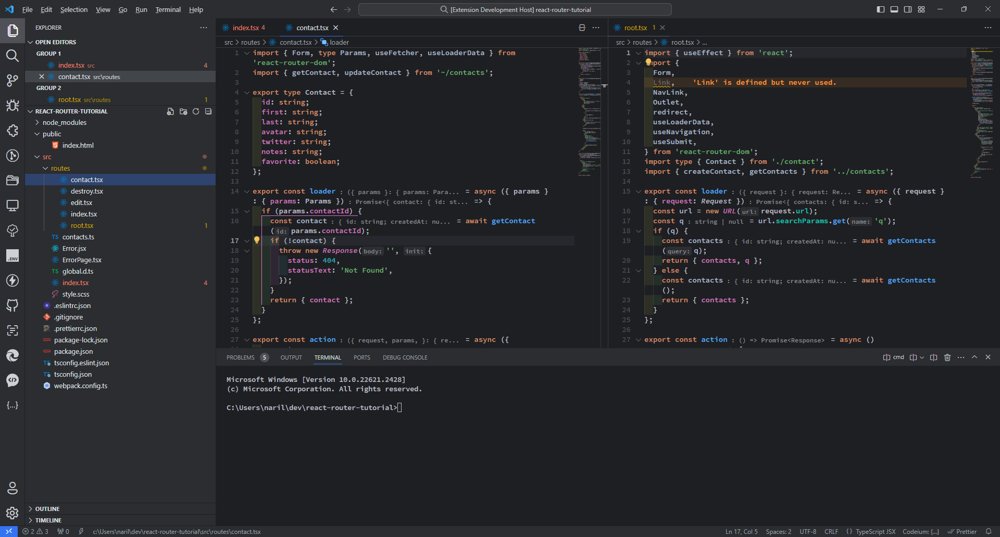
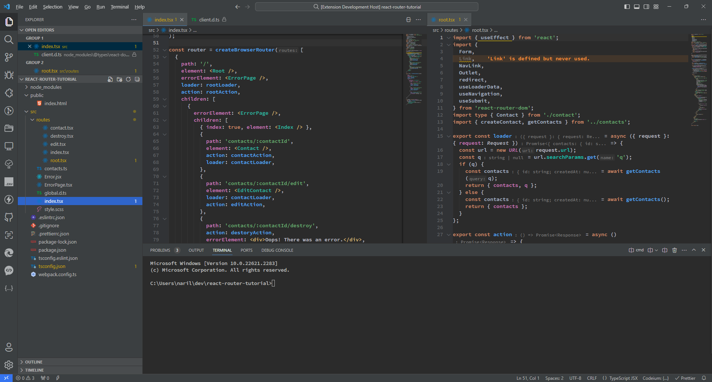

# Webstorm New Dark Theme

This theme has been designed with color schemes similar to [WebStorm's New UI](https://www.jetbrains.com/help/webstorm/new-ui.html).

The syntax highlighting follows the color palette of the WebStorm's New UI, while the editor's overall workbench style are divided between Darcula theme and the New UI theme.

## Preview

### New Dark



### New Darcula



## Installation

1. Open **Extensions** in VSCode's sidebar. (or From Command Palette (**Ctrl+Shift+P**), `View: Show Extensions`)
2. Search for `Webstorm New Dark Theme`.
3. Click **Install** to install it.
4. From Command Palette (**Ctrl+Shift+P**), select `Preferences: Color Theme` > `Webstorm New Dark` or `Webstorm New Darcula`.

## Supported Languages

- JavaScript
- TypeScript
- HTML
- CSS
- Markdown
- JSON

## Recommended Editor Settings

```json
"editor.fontFamily": "'Source Code Pro SemiBold'",
"editor.inlayHints.fontSize": 12,
"editor.inlayHints.padding": true,
```

- Changing the color of the indented space uses [indent-rainbow](https://marketplace.visualstudio.com/items?itemName=oderwat.indent-rainbow) extension.

## Resources

- [Webstorm Darcula Theme](https://marketplace.visualstudio.com/items?itemName=imekachi.webstorm-darcula)
- [Int UI Theme](https://marketplace.visualstudio.com/items?itemName=baran-wang.vscode-theme-jetbrains-new-ui)
